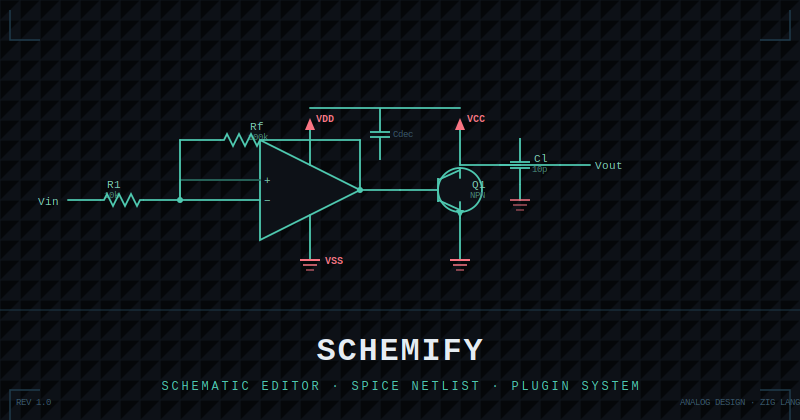

## Schemify

<p align="center">
  
</p>

Lighter, Faster, More Featureful Schematic Editor with easier support for development and plugin creation.

### Development

**Requires Zig 0.15+.** Use the Nix dev shell (provides Zig 0.15.2):

```bash
nix-shell shell.nix   # enter once, then use zig freely
zig build             # must run inside nix-shell
```

Without nix-shell, `zig build` will fail with a version error if your system Zig is older than 0.15.

#### Native (SDL3)

```bash
zig build                        # compile
zig build run                    # launch GUI

zig build run -- --open examples/inverter   # open example (reads Config.toml)
zig build run -- --open examples/diff_amp  # open diff_amp example

zig build run -- --cli help      # CLI mode

zig build test                   # run all tests
zig build -Doptimize=ReleaseFast # release build
```

`--open <project_dir>` loads the project's `Config.toml` and opens the first schematic (`.shn` in `paths.shn`, else `.sch` in `legacy_paths.schematics`).

#### Web (WASM)

```bash
zig build -Dbackend=web          # compile → zig-out/bin/{n1schem.wasm,web.js,index.html}
zig build -Dbackend=web run_local  # compile + serve at http://localhost:8080
```

`run_local` starts `python3 -m http.server 8080` in `zig-out/bin/`. Press Ctrl-C to stop.
