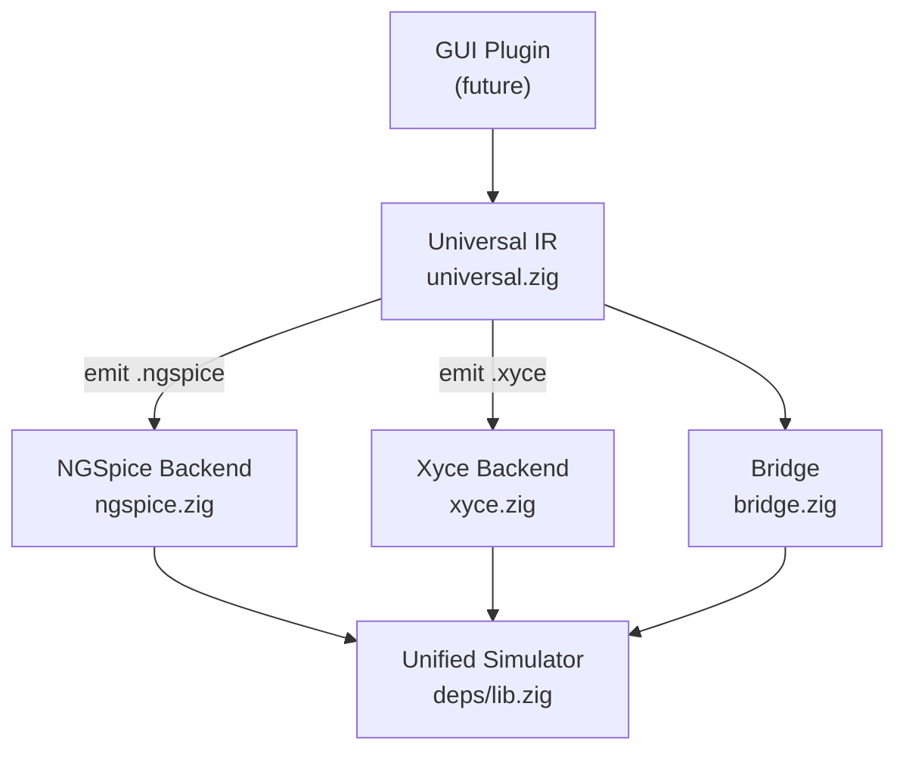

# SPICE Language Reference — Schemify Plugin Development Guide

> This document covers the SPICE netlist language as it relates to Schemify's dual-backend
> simulator infrastructure (NGSpice + Xyce), with a focus on what a **GUI plugin** must generate
> to replace hand-written SPICE and provide drop-in testbenches.

---

## 1. Netlist Structure Overview

Every SPICE netlist ("deck") follows this structure:

```spice
<title line>             ← first line is ALWAYS the title (not a directive)
<includes / libraries>
<options>
<parameters>
<models>
<component instances>
<analysis commands>
<output directives>
<.end>
```

| Rule | Detail |
|------|--------|
| **Title** | First line is the circuit title — never a directive |
| **Comments** | Lines starting with `*` are comments. `$` for end-of-line comments (ngspice) |
| **Continuation** | `+` at the start of a line continues the previous line |
| **Case** | SPICE is case-insensitive (except node names in some simulators) |
| **Ground** | Node `0` or `GND` is always the global ground reference |
| **End** | `.end` terminates the netlist |

### Engineering Suffixes

| Suffix | Multiplier | Suffix | Multiplier |
|--------|-----------|--------|-----------|
| `T` | 10¹² | `m` | 10⁻³ |
| `G` | 10⁹ | `u` | 10⁻⁶ |
| `MEG` | 10⁶ | `n` | 10⁻⁹ |
| `k` | 10³ | `p` | 10⁻¹² |
| | | `f` | 10⁻¹⁵ |

> [!WARNING]
> In SPICE, `M` means **milli** (10⁻³), not mega. Use `MEG` for 10⁶.

---

## 2. Component Instance Lines

Every component line follows the pattern:
```
<prefix><name> <nodes...> <model/value> [parameters...]
```

The **first character** determines the component type:

### 2.1 Passive Components

```spice
* Resistor:    R<name> <n+> <n-> <value> [m=<mult>]
R1 in out 10k
Rload out 0 {Rval}              ← parameterized value

* Capacitor:   C<name> <n+> <n-> <value> [ic=<initial>] [m=<mult>]
C1 out 0 1p ic=0

* Inductor:    L<name> <n+> <n-> <value> [ic=<initial>]
L1 in out 10u
```

### 2.2 Semiconductor Devices

```spice
* Diode:       D<name> <anode> <cathode> <model>
D1 in out MyDiode

* MOSFET:      M<name> <drain> <gate> <source> <bulk> <model> [W=] [L=] [M=]
M1 out in 0 0 NMOS_3V3 W=1u L=0.18u M=2

* BJT:         Q<name> <collector> <base> <emitter> [substrate] <model>
Q1 out in 0 NPN_model
```

### 2.3 Sky130 PDK MOSFET Syntax (XSchem/Subcircuit Style)

In modern PDKs like Sky130, MOSFETs are wrapped in subcircuits and instantiated with `X`:

```spice
XM1 drain gate source bulk sky130_fd_pr__nfet_01v8 L=0.15 W=1 nf=1
+ ad='int((nf+1)/2) * W/nf * 0.29'
+ as='int((nf+2)/2) * W/nf * 0.29'
+ pd='2*int((nf+1)/2) * (W/nf + 0.29)'
+ ps='2*int((nf+2)/2) * (W/nf + 0.29)'
+ nrd='0.29 / W' nrs='0.29 / W'
+ sa=0 sb=0 sd=0 mult=1 m=1
```

| Parameter | Meaning |
|-----------|---------|
| `W` | Total transistor width |
| `L` | Channel length |
| `nf` | Number of gate fingers (width per finger = W/nf) |
| `mult` / `m` | Parallel device multiplier (scales current by N) |
| `ad`, `as` | Drain/source diffusion area (for parasitic calculations) |
| `pd`, `ps` | Drain/source diffusion perimeter |
| `nrd`, `nrs` | Drain/source resistance per square |
| `sa`, `sb`, `sd` | Stress-effect parameters |

### 2.4 Independent Sources

```spice
* Voltage:     V<name> <n+> <n-> [DC <val>] [AC <mag> [phase]] [<waveform>]
V1 in 0 DC 1.8
V2 clk 0 PULSE(0 1.8 0 100p 100p 500n 1u)

* Current:     I<name> <n+> <n-> [DC <val>] [<waveform>]
I0 vdd bias 10u
```

### 2.5 Dependent Sources

```spice
* VCVS:        E<name> <n+> <n-> <ctrl+> <ctrl-> <gain>
E1 out 0 in 0 10

* CCCS:        F<name> <n+> <n-> <V-source> <gain>
* VCCS:        G<name> <n+> <n-> <ctrl+> <ctrl-> <transconductance>
* CCVS:        H<name> <n+> <n-> <V-source> <transresistance>
```

### 2.6 Behavioral Sources (B-source)

```spice
* Voltage:     B<name> <n+> <n-> V=<expression>
B1 out 0 V={if(V(in) > 0.9, 1.8, 0)}

* Current:     B<name> <n+> <n-> I=<expression>
B2 out 0 I={V(in) * 1m}
```

### 2.7 Subcircuit Instantiation

```spice
* X<name> <nodes...> <subcircuit_name> [param=value ...]
x1 vdd vout vminus vplus vbias vss OpAmp
```

---

## 3. Source Waveforms (Transient Stimulus)

These are specified as part of voltage/current source definitions for `.tran` analysis:

### PULSE — Digital Clocks, Bit Patterns
```
PULSE(V1 V2 TD TR TF PW PER)
```
| Param | Description | Default |
|-------|-------------|---------|
| V1 | Initial value | — |
| V2 | Pulsed value | — |
| TD | Delay before pulse | 0 |
| TR | Rise time | TSTEP |
| TF | Fall time | TSTEP |
| PW | Pulse width | TSTOP |
| PER | Period | TSTOP |

```spice
V1 clk 0 PULSE(0 1.8 0 100p 100p 500n 1u)
```

### SIN — Sinusoidal Signals
```
SIN(VO VA FREQ TD THETA PHASE)
```
| Param | Description |
|-------|-------------|
| VO | DC offset |
| VA | Amplitude |
| FREQ | Frequency (Hz) |
| TD | Delay |
| THETA | Damping factor (1/s) |
| PHASE | Phase (degrees) |

```spice
V1 in 0 SIN(0.9 0.5 1MEG)
```

### PWL — Piecewise Linear (Arbitrary Waveform)
```
PWL(T1 V1 T2 V2 ... TN VN)
```
```spice
V1 in 0 PWL(0 0 1n 0 2n 1.8 10n 1.8 11n 0)
```

### EXP — Exponential Rise/Decay
```
EXP(V1 V2 TD1 TAU1 TD2 TAU2)
```

### SFFM — Single-Frequency FM
```
SFFM(VO VA FC MDI FS)
```
| Param | Description |
|-------|-------------|
| VO | Offset |
| VA | Amplitude |
| FC | Carrier frequency |
| MDI | Modulation index |
| FS | Signal (modulating) frequency |

### PAT — Pattern Source (Xyce-native, ngspice emulated via PWL)
```
PAT(VHI VLO TD TR TF TBIT b<pattern>)
```
```spice
V1 data 0 PAT(1.8 0 0 100p 100p 1n b10110011)
```

---

## 4. Analysis Types

### 4.1 Core Analyses (Both NGSpice & Xyce)

```spice
* Operating Point
.op

* DC Sweep
.dc V1 0 5 0.1                     ← sweep V1 from 0→5V in 0.1V steps
.dc V1 0 5 0.1 V2 0 3 1            ← nested sweep

* AC (Frequency Response)
.ac dec 100 1k 1G                   ← 100 points/decade, 1kHz→1GHz

* Transient
.tran 1n 100u                       ← step=1ns, stop=100µs
.tran 1n 100u 10u 0.5n uic         ← start=10µs, max_step=0.5ns, use initial conditions

* Noise
.noise V(out) V1 dec 100 1 1G

* Transfer Function
.tf V(out) V1

* Sensitivity (DC on ngspice, extended on Xyce)
.sens V(out)

* Fourier
.four 1MEG V(out)
```

### 4.2 NGSpice-Only Analyses

```spice
* Pole-Zero
.pz in 0 out 0 vol pz

* Distortion
.disto dec 100 1k 10MEG

* Periodic Steady-State (experimental)
.pss 1e9 0 1024 10 150 1e-3

* S-Parameter
.sp dec 100 1MEG 10G
```

### 4.3 Xyce-Only Analyses

```spice
* Harmonic Balance
.HB 1e9 2.4e9
.options HBINT numfreq=7

* Multi-Time PDE
.MPDE ...

* Advanced Sensitivity (adjoint)
.sens objfunc={V(out)} adjoint=1
```

---

## 5. Control Directives

### Parameters
```spice
.param Rval=10k                     ← netlist parameter
.param W_size=0.42                  ← used in expressions: W={W_size*2}
.global_param Rval=10k              ← Xyce: modifiable by .STEP/.SAMPLING
```

### Model Definitions
```spice
.model MyNMOS NMOS level=54 VTH0=0.7 TOXE=3e-9 ...
.model MyDiode D IS=1e-14 N=1.05 BV=100
```

### Include / Library
```spice
.include /path/to/model_file.spice
.lib /path/to/library.lib tt          ← include section "tt" from library
```

### Options
```spice
.options RELTOL=1e-4 ABSTOL=1e-12 GMIN=1e-12
.options savecurrents                   ← ngspice: save branch currents
```

### Output
```spice
.print TRAN V(in) V(out) I(V1)
.save all
.save V(out) I(R1)
```

### Global Nodes
```spice
.GLOBAL GND VDD VSS
```

---

## 6. Subcircuit Definitions

```spice
.subckt OpAmp VDD Vout Vminus Vplus Vbias VSS
*.ipin Vplus                                  ← XSchem pin annotations
*.ipin Vminus
*.iopin VDD
*.iopin VSS
*.ipin Vbias
*.opin Vout

* --- internal circuit ---
XM1 net2 Vminus net1 VSS sky130_fd_pr__nfet_01v8 L=0.15 W=16 ...
XM2 net3 Vplus  net1 VSS sky130_fd_pr__nfet_01v8 L=0.15 W=16 ...
* ... more components ...

.ends
```

> [!IMPORTANT]
> **Node `0` inside a subcircuit connects to global ground**, not a local node.
> All other internal node names are local to the subcircuit scope.

### Parameterized Subcircuits
```spice
.subckt my_res n1 n2 PARAMS: R=1k
R1 n1 n2 {R}
.ends

Xr1 a b my_res R=4.7k
```

---

## 7. Measurement Statements

```spice
* Trigger/Target (propagation delay)
.meas TRAN t_rise TRIG V(out) VAL=0.1 RISE=1 TARG V(out) VAL=0.9

* Find value at time
.meas TRAN vout_at_10u FIND V(out) AT=10u

* Min/Max/Avg/RMS/Integral
.meas TRAN vpeak MAX V(out)
.meas TRAN vavg AVG V(out) FROM=10u TO=100u

* When (threshold crossing time)
.meas TRAN t_cross WHEN V(out)=0.9 RISE=1
```

---

## 8. Sweeps & Statistical Analysis

### 8.1 Xyce `.STEP` (Parametric Sweep)
```spice
.global_param Rval=1k
.STEP Rval LIST 100 1k 10k
.STEP Rval 100 10k 1k                     ← linear sweep
.STEP Rval DEC 10 100 10k                  ← decade sweep
```

### 8.2 Xyce `.SAMPLING` (Monte Carlo / LHS)
```spice
.SAMPLING
+ numsamples=100
+ sample_type=mc
+ param=Rval type=normal mean=1e3 std_dev=100
```

### 8.3 Xyce `.DATA` Tables
```spice
.DATA mydata Rval Cval
+ 1k 1p
+ 10k 10p
+ 100k 100p
.ENDDATA
```

### 8.4 NGSpice `.control` Emulation of Sweeps
NGSpice lacks native `.STEP` — sweeps are done via `.control` scripting:

```spice
.control
foreach Rval 100 1k 10k
  alterparam Rval = $Rval
  reset
  run
end
.endc
```

---

## 9. NGSpice `.control` Block Scripting

The `.control` / `.endc` block is an ngspice extension for post-simulation scripting:

```spice
.control
  * Run the simulation
  run

  * Create computed vectors
  let gain = V(out) / V(in)
  let power = abs(V(vdd) * I(Vsupply))

  * Conditional logic
  if gain[0] > 40
    echo "Gain spec met"
  end

  * Loops for parameter sweeps
  foreach val 100 1k 10k
    alterparam Rval = $val
    reset
    run
  end

  * Save results
  set filetype=ascii
  write output.raw V(out) V(in)

  * Plotting
  plot V(out) V(in) title "Transient Response"
  set units=degrees
  plot ph(V(out))
.endc
```

| Command | Purpose |
|---------|---------|
| `run` | Execute the analysis defined in the netlist |
| `let` | Create/assign a vector |
| `print` | Print vector values to console |
| `plot` | Graph vectors |
| `write` | Save vectors to `.raw` file |
| `foreach`/`end` | Loop over a list of values |
| `while`/`end` | While-loop |
| `if`/`else`/`end` | Conditional execution |
| `alterparam` | Change a `.param` value |
| `reset` | Reset the circuit to initial state |
| `op` | Run operating-point analysis |
| `set` | Set internal control variables |

---

## 10. NGSpice vs Xyce — Dialect Differences

This is critical for Schemify's universal IR, which must emit valid syntax for both backends.

| Feature | NGSpice | Xyce |
|---------|---------|------|
| **Parameter sweep** | `.control` + `foreach`/`alterparam` | `.STEP` (native) |
| **Monte Carlo** | `.control` scripting with `sgauss()`/`sunif()` | `.SAMPLING` (native) |
| **Harmonic Balance** | `.pss` (experimental) | `.HB` (native, robust) |
| **Pole-Zero** | `.pz` (native) | ❌ unsupported |
| **Distortion** | `.disto` (native) | ❌ (use `.HB` workaround) |
| **S-Parameters** | `.sp` (native) | `.LIN` + `.ac` |
| **Sensitivity** | `.sens` (DC only) | `.sens` (DC, AC, transient, adjoint) |
| **MPDE** | ❌ | ✅ native |
| **Co-simulation** | Callback API | `YGENEXT` external device interface |
| **Control scripting** | `.control`/`.endc` | ❌ not supported |
| **PAT source** | Emulated via PWL | Native |
| **M factor scope** | All components + subcircuits | R, L, C, some BJTs (not X devices) |
| **Case sensitivity** | Case-insensitive | Case-preserved but mostly insensitive |
| **Expressions** | Curly-brace `{}` syntax | Curly-brace `{}` syntax |
| **Global params** | `.param` (all are global) | `.global_param` (explicit) |
| **Function names** | `u()`, `pwr()`, `ln()`, `log()` | `stp()`, `PWR()`, `LOG()`, `LOG10()` |

> [!NOTE]
> The Schemify `universal.zig` IR handles these differences via the `expr_func_table` comptime
> lookup and backend-specific emission in `emitAnalysis()` / `emitSweep()`.

---

## 11. Testbench Anatomy (XSchem / Schemify Pattern)

XSchem-generated testbenches (the pattern in Schemify's examples) follow this structure:

```spice
** sch_path: /path/to/testbench.sch
**.subckt tb_name                        ← commented-out (top-level, not a subcircuit)

* --- DUT instantiation ---
x1 <nodes...> <dut_subcircuit_name>

* --- Stimulus sources ---
V1 clk GND PULSE(0 1.8 0 50p 50p 500n 1u)
V2 vdd GND 1.8
I0 vdd bias 10u

* --- Load / measurement ---
R1 out GND 1k
C1 out GND 5p
V_meas node_a node_b 0              ← 0V source for current measurement

**** begin user architecture code

* Parameters
.param min_width=0.42
.param length=0.425

* Simulation commands
.control
  tran 50p 4u
  write tb_name.raw
.endc

* PDK model includes
.lib ~/.volare/sky130A/libs.tech/ngspice/sky130.lib.spice tt
.include ~/.volare/sky130A/libs.tech/ngspice/corners/tt.spice

**** end user architecture code
**.ends

* --- Expanded subcircuit definitions follow ---
.subckt dut_subcircuit_name <ports...>
  * ... internal components ...
  .param min_width=0.42
.ends

.subckt OpAmp VDD Vout Vminus Vplus Vbias VSS
  * ... internal components ...
.ends

.GLOBAL GND VDD VSS
.end
```

### Key Testbench Patterns

| Pattern | Purpose | Example |
|---------|---------|---------|
| **0V voltage source** | Current measurement probe | `V_meas node_a node_b 0` → measure `I(V_meas)` |
| **PULSE pairs** | Complementary digital signals | `V1 B0 GND PULSE(0 1.8 ...)` + `V2 B0_bar GND PULSE(1.8 0 ...)` |
| **Binary-weighted timing** | DAC bit toggling | Period doubles per bit: B0=30n, B1=60n, B2=121n... |
| **OpAmp in feedback** | TIA / current-to-voltage | `x2 vdd vout vminus vplus vbias vss OpAmp` + feedback R |
| **Power measurement** | Compute power in `.control` | `let power = abs(v_in * v_supply#branch)` |

---

## 12. Schemify's SPICE Infrastructure

### Architecture Layers



### File Map

| File | Role |
|------|------|
| [deps/lib.zig](file:///home/omare/Documents/UWASIC/Schemify/deps/lib.zig) | Unified `Simulator` API over NGSpice/Xyce |
| [deps/ngspice.zig](file:///home/omare/Documents/UWASIC/Schemify/deps/ngspice.zig) | Zig bindings for `libngspice.so` (callback-driven C API) |
| [deps/xyce.zig](file:///home/omare/Documents/UWASIC/Schemify/deps/xyce.zig) | Zig bindings for Xyce via `xyce_c_api.h` C shim |
| [src/core/spice/universal.zig](file:///home/omare/Documents/UWASIC/Schemify/src/core/spice/universal.zig) | 1400-line universal IR (all types, builder API, emitter) |
| [src/core/spice/bridge.zig](file:///home/omare/Documents/UWASIC/Schemify/src/core/spice/bridge.zig) | Validate → emit → temp file → load → run pipeline |
| [src/core/spice/root.zig](file:///home/omare/Documents/UWASIC/Schemify/src/core/spice/root.zig) | Re-exports: `Netlist`, `Backend`, `RunResult` |

### Universal IR Type Coverage

The IR in `universal.zig` covers:

**Components** (7 types + raw):
`Resistor`, `Capacitor`, `Inductor`, `Diode`, `Mosfet`, `Bjt`, `Subcircuit`, `BehavioralSource`, `IndependentSource`

**Source Waveforms** (8 types):
`DC`, `AC`, `SIN`, `PULSE`, `PWL`, `EXP`, `SFFM`, `PAT`

**Analyses** (14 types):
`OP`, `DC`, `AC`, `TRAN`, `NOISE`, `SENS`, `TF`, `PZ`, `DISTO`, `PSS`, `SP`, `HB`, `MPDE`, `FOUR`

**Sweeps / UQ** (5 types):
`StepSweep`, `Sampling`, `EmbeddedSampling`, `PCE`, `DataTable`

**Measures** (4 kinds):
`TrigTarg`, `Find`, `MinMax`, `When`

Each type carries a `BackendSupport` struct indicating `native`, `emulated`, or `unsupported` per backend.

### Function Name Translation Table

The IR translates universal function names to backend-specific names at comptime:

| Universal | NGSpice | Xyce |
|-----------|---------|------|
| `if` | `ternary_fcn` | `IF` |
| `step` | `u` | `stp` |
| `ln` | `ln` | `LOG` |
| `log10` | `log` | `LOG10` |
| `pow` | `pwr` | `PWR` |
| `sdt` (integral) | `idt` | `SDT` |

---

## 13. GUI Plugin Requirements

For a GUI plugin that replaces hand-written SPICE, it must be able to generate:

### What the Plugin Produces
1. **A `Netlist` struct** via the builder API (`addComponent`, `addSource`, `addAnalysis`, etc.)
2. **Backend-agnostic** — the IR handles dialect translation
3. **Drop-in testbenches** that follow the XSchem pattern (section 11)

### Required GUI Capabilities

| Capability | SPICE Concept | IR Type |
|------------|---------------|---------|
| Place resistor/cap/inductor | `R`/`C`/`L` lines | `Component.resistor` etc. |
| Place MOSFET with PDK model | `XM...` subcircuit instance | `Component.mosfet` or `Component.subcircuit` |
| Place voltage/current source | `V`/`I` lines | `IndependentSource` |
| Configure waveform (PULSE, SIN, etc.) | Source waveform args | `SourceWaveform` union |
| Wire nodes together | Node name assignment | Node strings in component structs |
| Set parameters | `.param` | `Netlist.addParam()` |
| Include PDK models | `.lib` / `.include` | `Netlist.addLib()` / `Netlist.addInclude()` |
| Choose analysis type | `.tran` / `.ac` / `.dc` / `.op` | `Netlist.addAnalysis()` |
| Add measurements | `.meas` | `Netlist.addMeasure()` |
| Configure sweeps | `.STEP` / `.control foreach` | `Netlist.addSweep()` |
| Select target backend | ngspice vs xyce | `Backend` enum on `emit()` |

### Drop-in Testbench Generation

A testbench is a `Netlist` that:
1. Instantiates the DUT as a `Component.subcircuit`
2. Adds stimulus sources with appropriate waveforms
3. Adds load components (R, C)
4. Adds 0V voltage sources for current probes
5. Adds analysis commands (`.tran`, `.ac`)
6. Adds `.meas` statements for automated characterization
7. Includes PDK model libraries via `.lib`
8. Optionally adds `.control` blocks for ngspice post-processing

---

## 14. Common Testbench Templates

### OpAmp AC Characterization
```zig
var nl = Netlist.init(allocator);
nl.title = "OpAmp Testbench";

// DUT
try nl.addComponent(.{ .subcircuit = .{
    .name = "OpAmp",
    .inst_name = "x1",
    .nodes = &.{ "vdd", "vout", "vminus", "vplus", "vbias", "vss" },
    .params = &.{},
}});

// Stimulus
try nl.addSource(.{ .name = "V1", .kind = .voltage, .p = "vdd", .n = "0", .dc = 1.8 });
try nl.addSource(.{ .name = "V2", .kind = .voltage, .p = "vplus", .n = "0",
    .dc = 0.9, .ac_mag = 1e-3 });
try nl.addSource(.{ .name = "V3", .kind = .voltage, .p = "vminus", .n = "0", .dc = 0.9 });

// Load
try nl.addComponent(.{ .capacitor = .{ .name = "CL", .p = "vout", .n = "0",
    .value = .{ .literal = 5e-12 } }});

// Analysis
try nl.addAnalysis(.{ .ac = .{ .sweep = .dec, .n_points = 100,
    .f_start = 0.1, .f_stop = 1e9 }});

// PDK
try nl.addLib(.{ .path = "sky130.lib.spice", .section = "tt" });
```

### DAC Transient with Binary-Weighted Clocks
```zig
// Generate complementary PULSE pairs for each bit
for (0..num_bits) |i| {
    const period = base_period * std.math.pow(f64, 2, @as(f64, @floatFromInt(i)));
    try nl.addSource(.{
        .name = bit_names[i],
        .kind = .voltage, .p = bit_nodes[i], .n = "0",
        .waveform = .{ .pulse = .{
            .v1 = 0, .v2 = 1.8, .delay = 0,
            .rise = 50e-12, .fall = 50e-12,
            .width = period / 2, .period = period,
        }},
    });
}
```

---

## References

- [NGSpice User's Manual](https://ngspice.sourceforge.io/docs/ngspice-manual.pdf)
- [Xyce Reference Guide](https://xyce.sandia.gov/documentation/Xyce_Reference_Guide.pdf)
- [Sky130 PDK Documentation](https://skywater-pdk.readthedocs.io/)
- [BSIM4 Model Manual (UC Berkeley)](https://bsim.berkeley.edu/models/bsim4/)
- [XSchem Documentation](https://xschem.sourceforge.io/stefan/index.html)
